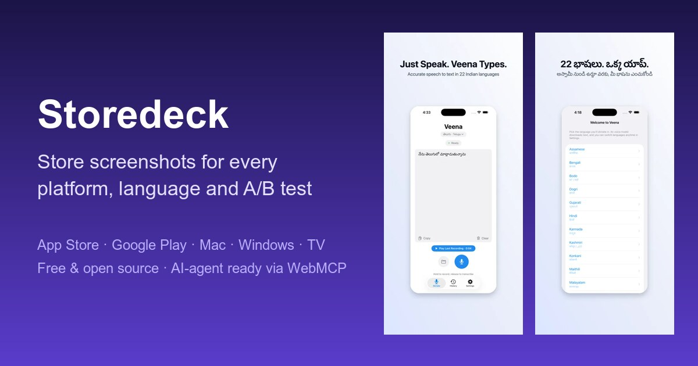
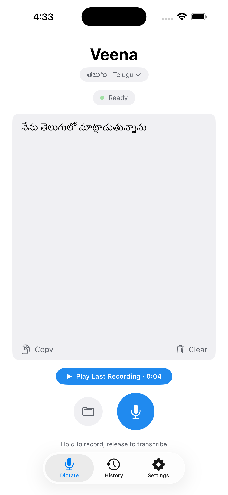
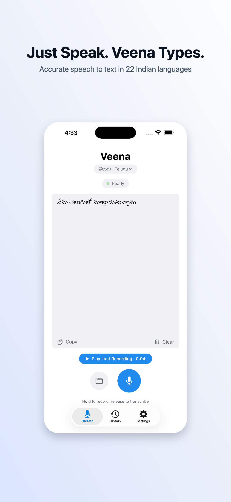
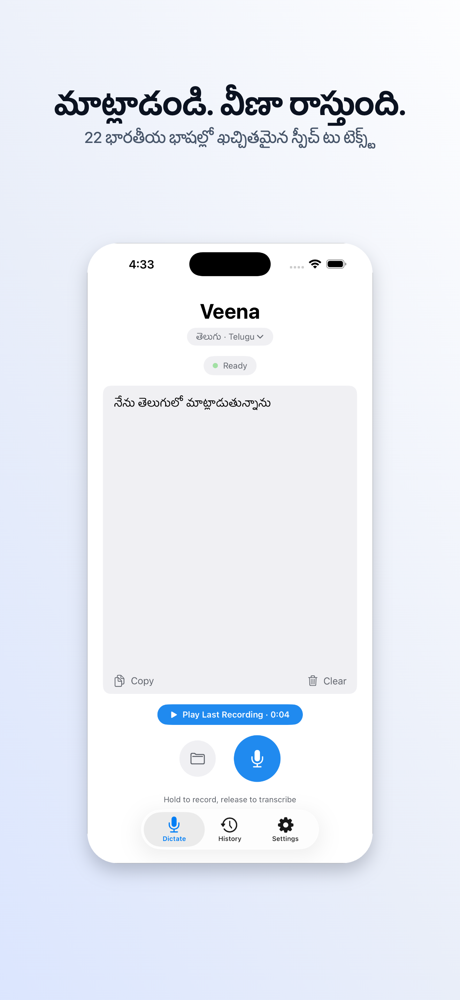

# Storedeck

Free, open-source editor for **store screenshots on every platform** — App Store,
Google Play, Mac App Store, Microsoft Store, Steam, Amazon Fire TV and smart-TV
stores — with **A/B test variants**, **localization** and full **AI-agent
control through WebMCP**.

**[Open the editor](https://storedeck.byanr.com/editor)** · [Guides](https://storedeck.byanr.com/guides) · [Screenshot sizes](https://storedeck.byanr.com/screenshot-sizes) · [For AI agents](https://storedeck.byanr.com/agents)



[](LICENSE)

## How it's organized

| Level | What it is |
| --- | --- |
| **Project** | One app — its languages and every screenshot set you make for it |
| **Variant** | An A/B test arm (draft · control · testing · winner · archived) with a hypothesis |
| **Platform** | A store + device + exact size: iPhone 6.9", Android phone, iPad 13", Mac, Apple TV, Windows, Steam, Fire TV… |
| **Language** | Copy and screenshots per locale, with fallbacks and per-language layout overrides |

## Features

- **22 platforms across 7 stores** with the exact sizes, counts and formats each accepts ([catalog](src/lib/model/platforms.ts)); custom sizes are validated against store rules.
- **Copy a platform to another** — start Android, iPad or TV from your iPhone set; screens, copy and styling rescale automatically.
- **Localization** — filename language detection (`home_de.png`), strings table with missing translations, board view of every screen × language, RTL rendering, CJK/Thai line breaking, per-language sizes.
- **A/B variants** — duplicate a whole set, record status and hypothesis, compare side by side, export per variant for App Store Product Page Optimization or Google Play store listing experiments.
- **Design** — gradients (CSS-accurate angles, radial), solid or image backgrounds, noise, overlays; 2D device frames (phone, tablet, watch, laptop, monitor, app window, browser, TV); 3D iPhone 15 Pro Max and Galaxy S25 Ultra; layout presets including side-by-side for landscape; Google Fonts; overlay elements (text badges with pill/laurel frames, emoji, 1,900+ Lucide icons, images); magnified popouts.
- **Undo/redo**, autosave to IndexedDB, project backup files, import of projects from Storedeck v1.
- **Export** PNG/JPEG at store sizes (never with alpha), zipped as `variant/platform-WxH/language/NN-name.png`.
- **SEO & discovery** — prerendered guides, FAQ and per-store size pages with JSON-LD, sitemap, `llms.txt` and `llms-full.txt`.

## AI agents (WebMCP)

Storedeck registers **22 WebMCP tools** with `document.modelContext` on every
page, covering the whole editor: projects, variants, platforms, screens,
languages, copy, backgrounds, devices, typography, elements, popouts, views,
undo/redo, rendered previews with layout warnings, and export. Without WebMCP,
the same tools are callable as `window.storedeck.callTool(name, input)`.

- Tool reference: [storedeck.byanr.com/agents](https://storedeck.byanr.com/agents) (generated from [`src/lib/webmcp/specs.ts`](src/lib/webmcp/specs.ts))
- Drop [`AGENTS_SNIPPET.md`](AGENTS_SNIPPET.md) into your app repo's `AGENTS.md` so coding agents can refresh your store screenshots end to end.

## Demo — Veena (before → after, EN + TE)

See **[demo/README.md](demo/README.md)** — raw simulator captures turned into
styled App Store screenshots in English and Telugu by an agent using the WebMCP
tools.

| Before (simulator) | After (English) | After (Telugu) |
|--------------------|-----------------|----------------|
|  |  |  |

## Development

Requires Node 22+ and pnpm.

```bash
pnpm install
pnpm dev          # http://localhost:3000
pnpm test         # unit + WebMCP tool tests
pnpm typecheck
pnpm build        # prerendered site + client editor in dist/client
pnpm preview
```

Architecture notes for contributors and coding agents live in [AGENTS.md](AGENTS.md).

## Deployment

Storedeck is a static site: the prerendered pages and the client-only editor in
`dist/client` need no server code. The official site at
[storedeck.byanr.com](https://storedeck.byanr.com) runs on **Cloudflare
Workers static assets**, and you can deploy your own copy the same way:

```bash
pnpm exec wrangler login   # once, with your Cloudflare account
pnpm run cf:preview        # build and serve locally on the Workers runtime
pnpm run cf:deploy         # build and deploy a Worker named "storedeck"
pnpm run cf:deploy --name my-storedeck --domain screenshots.example.com
```

[`wrangler.jsonc`](wrangler.jsonc) serves pages at clean URLs without trailing
slashes and `404.html` for unknown paths; [`public/_headers`](public/_headers)
sets security and cache headers. Use `pnpm run cf:deploy` — plain `pnpm deploy`
is a different, built-in pnpm command.

### Self-hosting with Docker

```bash
docker compose up -d --build   # http://localhost:8080
```

The image builds the site and serves `dist/client` with nginx
([`nginx.conf`](nginx.conf)). Any static host works the same way: serve
`dist/client`, map `/path` to `/path/index.html`, and use `404.html` for
unknown URLs.

## Tech stack

React 19 · TanStack Start/Router · Vite · Tailwind CSS v4 · Zustand + Immer ·
HTML Canvas · Three.js · IndexedDB (idb) · JSZip · WebMCP · Cloudflare Workers

## License

MIT — see [LICENSE](LICENSE).

## Credits

- **Samsung Galaxy S25 Ultra 3D Model** by [mistJS](https://sketchfab.com/mistjs) — [CC BY 4.0](https://creativecommons.org/licenses/by/4.0/)
- **iPhone 15 Pro Max 3D Model** by [MajdyModels](https://sketchfab.com/majdymodels) — [CC BY 4.0](https://creativecommons.org/licenses/by/4.0/)
