# Demo — Veena (speech-to-text, 22 Indian languages)

End-to-end example of using Storedeck (via WebMCP site tools + visual verification)
to turn raw simulator screenshots into minimal, App Store-ready styled screenshots
in **English** and **Telugu**.

- **Before (raw):** [`veena/before/`](veena/before/) — 6 simulator captures
- **After (styled, English):** [`veena/after/en/`](veena/after/en/) — 4 finals
- **After (styled, Telugu):** [`veena/after/te/`](veena/after/te/) — 4 finals

## Before → After

### 01 — Dictate

| Before | After (EN) | After (TE) |
|--------|------------|------------|
| 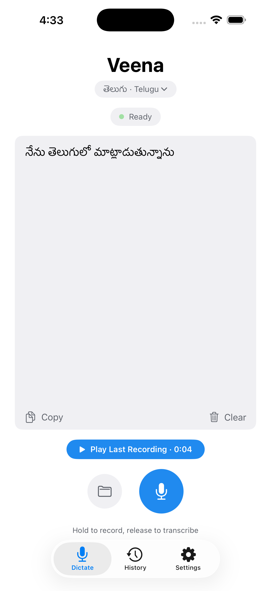 | 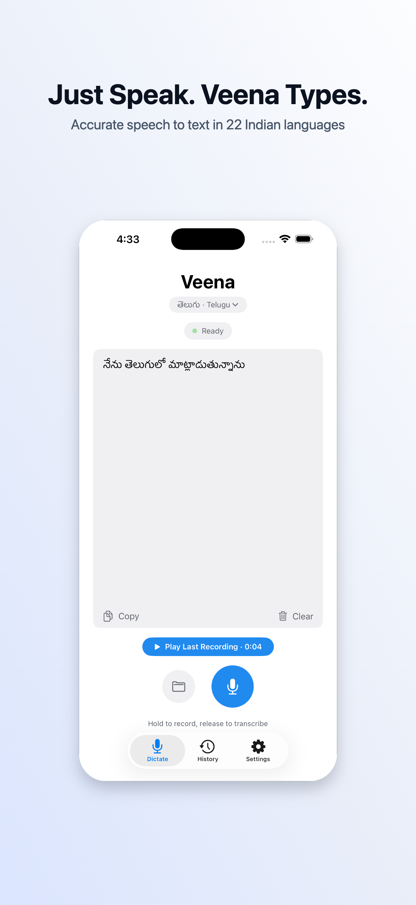 | 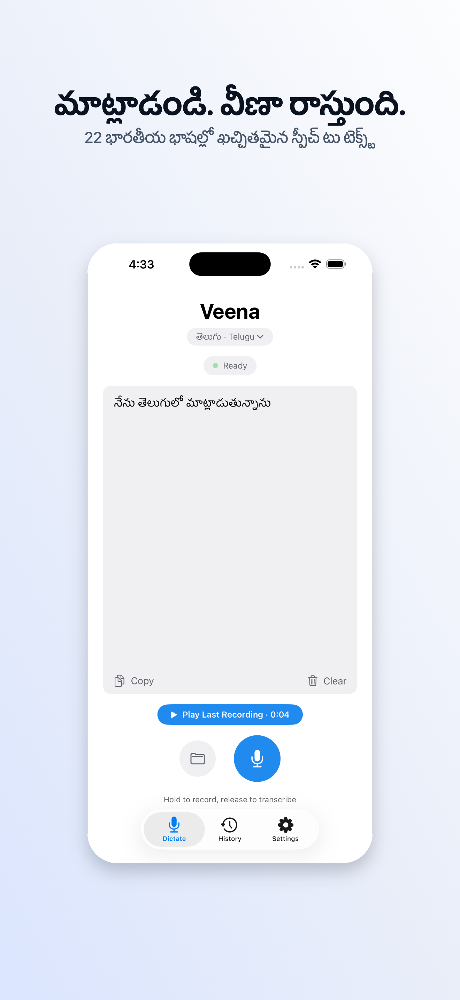 |

- EN: **"Just Speak. Veena Types."** / *"Accurate speech to text in 22 Indian languages"*
- TE: **"మాట్లాడండి. వీణా రాస్తుంది."** / *"22 భారతీయ భాషల్లో ఖచ్చితమైన స్పీచ్ టు టెక్స్ట్"*

### 02 — Languages (top)

| Before | After (EN) | After (TE) |
|--------|------------|------------|
| 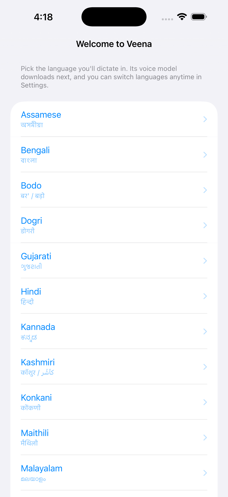 | 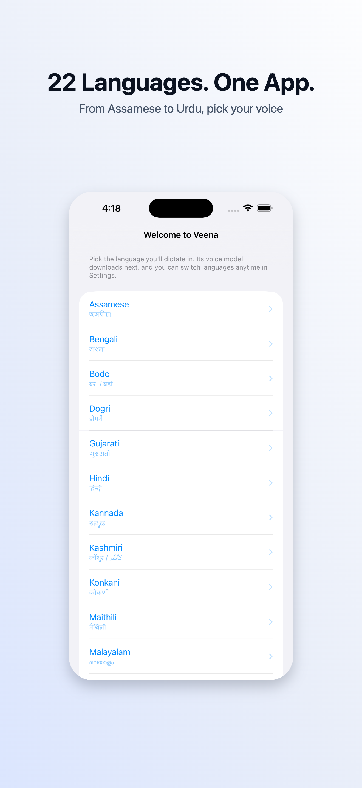 | 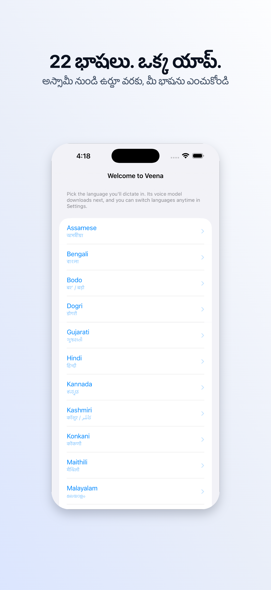 |

- EN: **"22 Languages. One App."** / *"From Assamese to Urdu, pick your voice"*
- TE: **"22 భాషలు. ఒక్క యాప్."** / *"అస్సామీ నుండి ఉర్దూ వరకు, మీ భాషను ఎంచుకోండి"*

### 03 — Languages (bottom)

| Before | After (EN) | After (TE) |
|--------|------------|------------|
| 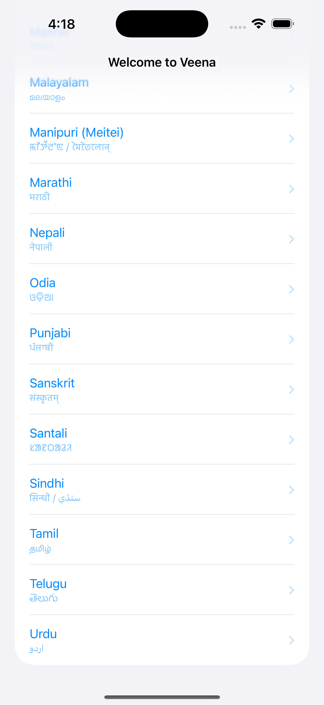 | 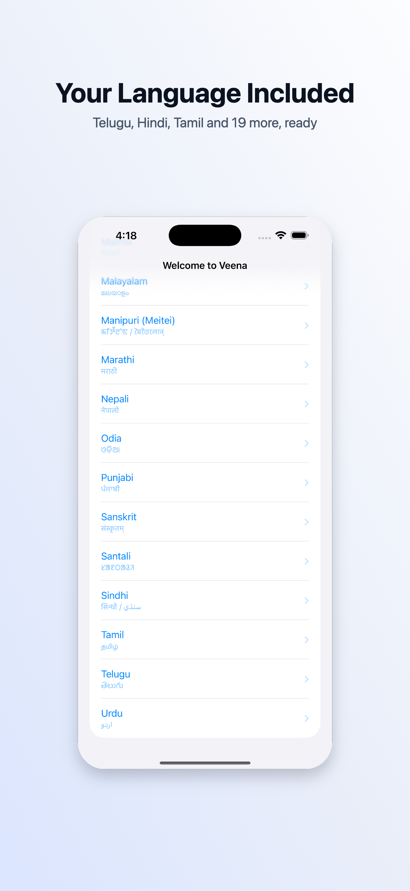 | 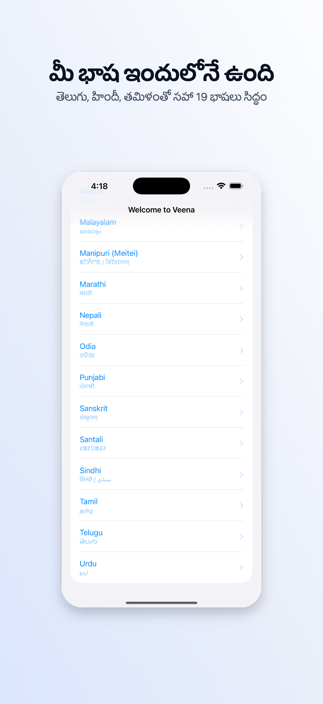 |

- EN: **"Your Language Included"** / *"Telugu, Hindi, Tamil and 19 more, ready"*
- TE: **"మీ భాష ఇందులోనే ఉంది"** / *"తెలుగు, హిందీ, తమిళంతో సహా 19 భాషలు సిద్ధం"*

### 04 — Private by design (Settings)

| Before | After (EN) | After (TE) |
|--------|------------|------------|
| 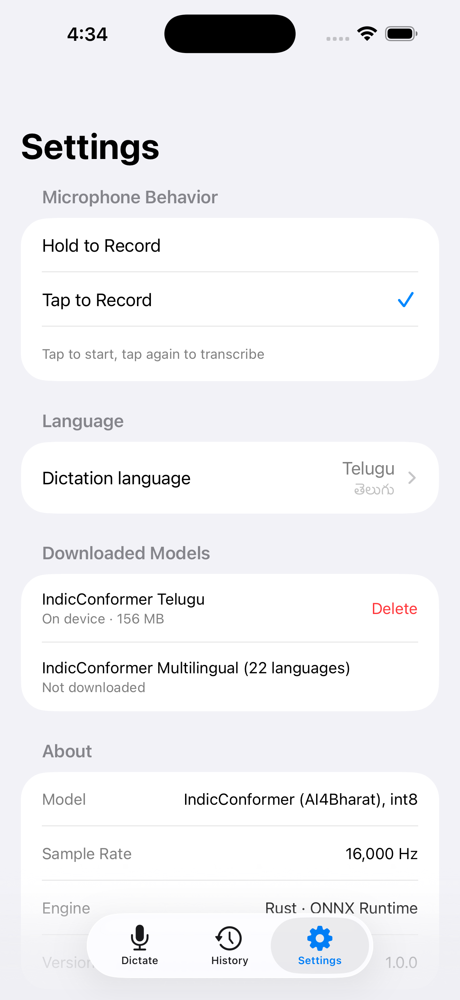 | 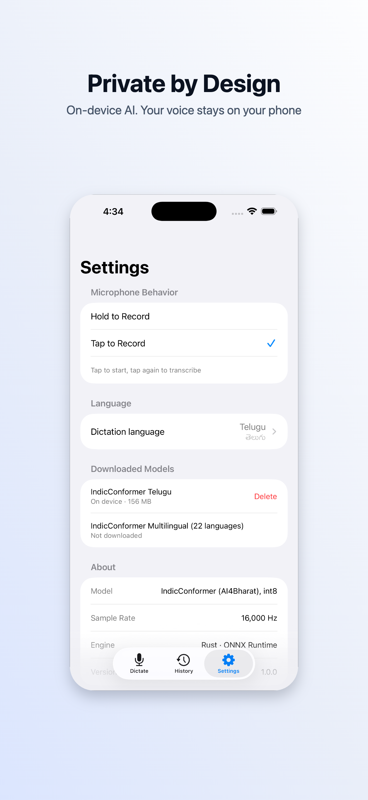 | 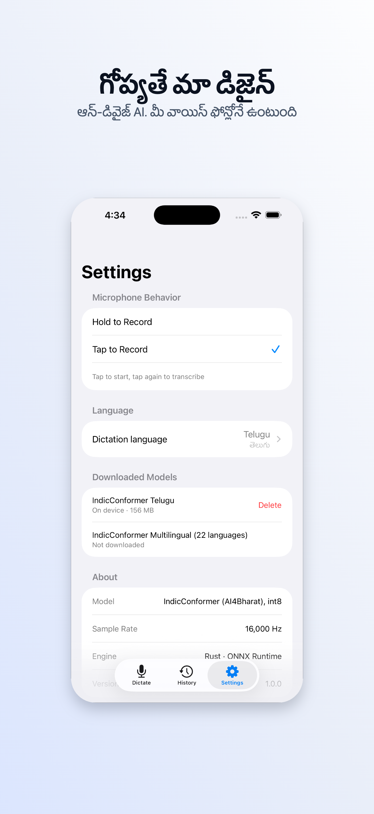 |

- EN: **"Private by Design"** / *"On-device AI. Your voice stays on your phone"*
- TE: **"గోప్యతే మా డిజైన్"** / *"ఆన్-డివైజ్ AI. మీ వాయిస్ ఫోన్లోనే ఉంటుంది"*

Extra raw captures not used in the final set (alternate language-picker states):

- [`veena/before/05-language-select-top.png`](veena/before/05-language-select-top.png)
- [`veena/before/06-language-select-bottom.png`](veena/before/06-language-select-bottom.png)

## Copy used (all 4 finals)

| # | EN heading | EN subheading | TE heading | TE subheading |
|---|-----------|---------------|-----------|---------------|
| 01 | Just Speak. Veena Types. | Accurate speech to text in 22 Indian languages | మాట్లాడండి. వీణా రాస్తుంది. | 22 భారతీయ భాషల్లో ఖచ్చితమైన స్పీచ్ టు టెక్స్ట్ |
| 02 | 22 Languages. One App. | From Assamese to Urdu, pick your voice | 22 భాషలు. ఒక్క యాప్. | అస్సామీ నుండి ఉర్దూ వరకు, మీ భాషను ఎంచుకోండి |
| 03 | Your Language Included | Telugu, Hindi, Tamil and 19 more, ready | మీ భాష ఇందులోనే ఉంది | తెలుగు, హిందీ, తమిళంతో సహా 19 భాషలు సిద్ధం |
| 04 | Private by Design | On-device AI. Your voice stays on your phone | గోప్యతే మా డిజైన్ | ఆన్-డివైజ్ AI. మీ వాయిస్ ఫోన్లోనే ఉంటుంది |

Design notes: minimal light gradient background, centered 2D device mockup with
shadow + rounded corners, heading + subheading on top with generous spacing —
per the prompt below.

## Prompt used

The styled screenshots above were produced by an AI agent driven with
`agent-browser` + Storedeck's WebMCP site tools, using this prompt:

> I have simulator screenshots of Veena a speech to text application that
> supports 22 Indian languages at
> '/Users/anr/projects/appscreen/veena-screenshots'. I want you to use
> agent-browser open "https://storedeck.byanr.com" and use the webmcp tools
> available to create Stylised App Store screenshots for this application They
> should have a heading and a subheading with enough spacing in between and
> around. Visually verify the end result the screenshots should be minimal and
> aesthetically pleasing with headings the help the user understand the app and
> motivate him to click that install button. create in both english and telugu
> languages.

## How to reproduce

1. Serve Storedeck locally (`python3 -m http.server 8000`) or open
   [storedeck.byanr.com](https://storedeck.byanr.com).
2. Upload the images in [`veena/before/`](veena/before/).
3. Apply a minimal light background, centered device frame, heading +
   subheading copy from the table above (English first, then duplicate for
   Telugu via the language menu / WebMCP `set_text_content`).
4. Visually verify spacing and export per language
   (WebMCP `export` tool or Export → all languages as ZIP).
